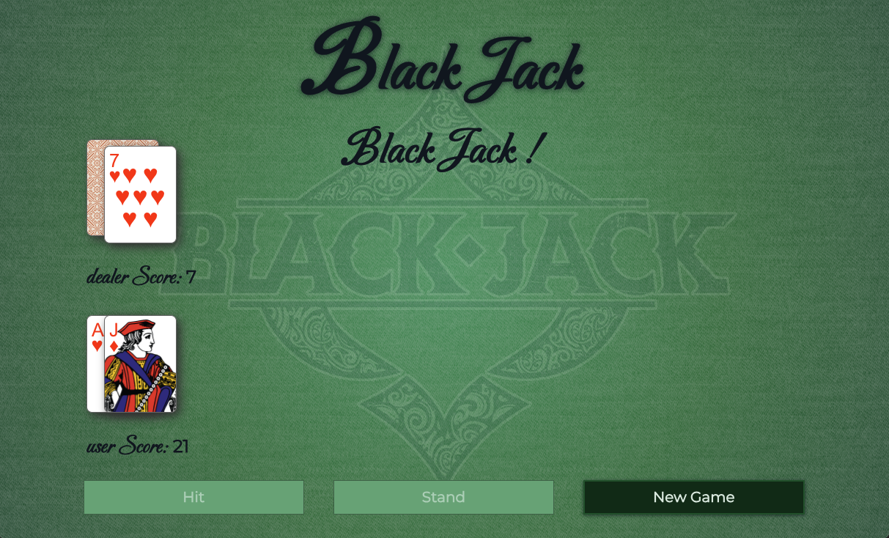

# <center>BLACK-JACK</center>



## Please take a look at the [ADR](ADR.md) ( Architectural Decision Record), to understand the decisions made

Please use **pnpm** as a package manager for both projects

## How to start

There are two applications under this folder, one that deploys the front-end application under the `/client` folder and another one that used to be the BFF, under the `server` folder. To run the game **you need to start both applications**.

both services run with the same command name `pnpm dev`

You will also need to install the corresponding dependencies needed to run the applications, so you have to go to each folder and run:

```bash
pnpm i
```

## CLIENT (Front end application)

### How to start front-end application

After installing dependencies

#### DEV MODE

```bash
pnpm dev
```

this will publish the compiled dev app with hot reload to `localhost:5173`

#### MOCKED VERSION

```bash
pnpm dev:msw
```

#### PRODUCTION

```bash
pnpm build
```

This will run a dev version with mocked calls. Since this is a non-deterministic game we need to
easily reproduce different use cases, which is why we are using this mocking service to
achieve such a task and be able to reproduce on a deterministic way different flows from the game

### Environments

You can change your environment variables pointing to a server by overriding ENV var to be set to development, production, or staging

### Testing

#### Unit test:

I'm unit testing **_only non-visual_** modules like composables, stores, etc, for more info on this decision please read [ADR](./ADR.md)

```bash
pnpm test:unit  # I'm assuming that you previously installed dependencies and you are in the client folder
```

#### Component test:

Cypress component testing for any visual component or view.
I combine these tests with cypress assertions and visual regression test

Due to time constraints I didn't do all the unit tests for components since they are all very similar and they are already covered visually on the e2e visual regression test, but please take a look under the two most relevant `src/components/BJButton.cy.ts` and `src/components/BJCard.cy.ts`

```bash
pnpm test:components # runs cypress (headless)
pnpm test:components:dev # opens cypress (chrome)
```

#### e2e test:

Cypress e2e or integration test. These tests are mocked using MSW.
THese tests are mocked because we are playing a non-deterministic game and if we were hitting back-end server and due to the nature of our test we would get a flaky test.

But we can easily do a real e2e test by running a test without `VITE_MSW` env var and adding a running test that we know is not going to fail on a none deterministic environment

```bash
pnpm test:e2e # runs cypress (headless)
pnpm test:e2e:dev # opens cypress (chrome)
```

**gotcha:** I also created a `test:components:ci` to run within GitHub actions that will not check for visual regression since visual regression depends on the machine, and cypress config are also different if you try to execute `run` or `open`

#### Automatic Visual Regression test

To run the test they are integrated within the component cypress test so just run any of

##### COMPONENTS

```bash
pnpm test:components # runs cypress (headless)
pnpm test:components:dev # opens cypress (chrome)
```

If there are changes on the visual test and those changes are legit you will need to regenerate all the base images to keep the changes

```bash
pnpm test:components:visual-regenerate # to regenerate components screenshots
```

##### E2E TEST (game flows)

```bash
pnpm test:e2e:visual-regenerate # to regenerate components screenshots
```

# SERVER

Please use **pnpm** as a package manager for both projects

## how to start back end application (dev mode)

from `./server` folder after installing dependencies run

```bash
pnpm dev
```

This will run a dev server on `localhost:3000`

it will compile the dev app with hot reload to `localhost:3000`

### Testing

#### Unit test and integration test

```bash
pnpm test
```

This command will run both tests, unit test (vitest) and integration test (with superset)
